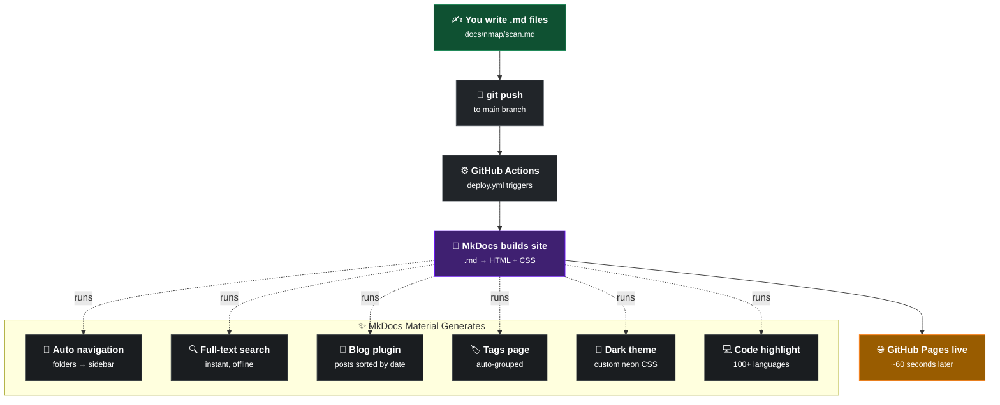

<div align="center">

```text
 ██╗  ██╗ ██████╗ ██╗  ██╗    ██████╗ ██╗   ██╗████████╗███████╗███████╗
 ██║  ██║██╔═████╗██║  ██║    ██╔══██╗╚██╗ ██╔╝╚══██╔══╝██╔════╝██╔════╝
 ███████║██║██╔██║███████║    ██████╔╝ ╚████╔╝    ██║   █████╗  ███████╗
 ╚════██║████╔╝██║╚════██║    ██╔══██╗  ╚██╔╝     ██║   ██╔══╝  ╚════██║
      ██║╚██████╔╝     ██║    ██████╔╝   ██║      ██║   ███████╗███████║
      ╚═╝ ╚═════╝      ╚═╝    ╚═════╝    ╚═╝      ╚═╝   ╚══════╝╚══════╝
```

**Personal security notes, tool references & articles**

[](https://github.com/subrat243/404Byte/actions/workflows/deploy.yml)
[](https://subrat243.github.io/404-Bytes/)
[](https://squidfunk.github.io/mkdocs-material/)
[](LICENSE)

[**→ Visit the Site 🚀**](https://subrat243.github.io/404-Bytes/)

</div>

---

## 🚀 What is this?

**404>Bytes** is my personal knowledge base for security research, CTF writeups, and tool references. Built with MkDocs Material and auto-deployed to GitHub Pages on every push — zero manual steps.

---

## ⚙️ How it works

The deployment pipeline is fully automated. You just write markdown, and GitHub Actions takes care of the rest.



---

## 📂 Categories

The notes are organized into logical directories. They cover foundational command line skills, scripting, penetration testing methodologies and tool usage, and core theoretical concepts. There is also a dedicated space for full-length articles and CTF writeups mapped seamlessly via MkDocs' awesome pages plugin.

- 💻 **Foundations**
- 🛡️ **Penetration Testing**
- 📚 **TryHackMe**
- 🛠️ **Tools**
- 📝 **Articles**

---

## 📝 Adding Notes

```bash
# Add a note to an existing category
echo "# My Note" > docs/nmap/stealth-scan.md

# Add a brand new category
mkdir docs/wireshark
echo "# Wireshark" > docs/wireshark/index.md

# Push — site updates automatically
git add . && git commit -m "add: wireshark notes" && git push
```

---

## ✍️ Writing a Blog Post

Create a file in `docs/blog/posts/` with the required Frontmatter:

```markdown
---
date: 2025-06-01
authors:
  - subrat243
categories:
  - CTF
tags:
  - writeup
  - web
---

# My Post Title

Short preview shown on the blog listing page.

<!-- more -->

Full content continues here...
```

---

## 💻 Local Preview

Do you want to preview the site locally before pushing?

```bash
# Install dependencies
pip install mkdocs-material mkdocs-awesome-pages-plugin

# Serve locally with live reload
mkdocs serve
```

Open [http://localhost:8000](http://localhost:8000) inside your web browser.

---

## 🛠️ Tech Stack

- [**MkDocs Material**](https://squidfunk.github.io/mkdocs-material/) — theme and framework
- [**mkdocs-awesome-pages**](https://github.com/lukasgeiter/mkdocs-awesome-pages-plugin) — auto navigation from folder structure
- [**GitHub Actions**](https://github.com/features/actions) — CI/CD pipeline
- [**GitHub Pages**](https://pages.github.com/) — free hosting

---

<div align="center">
<sub>Made by <a href="https://github.com/subrat243">subrat243</a> · <a href="LICENSE">MIT License</a></sub>
</div>
